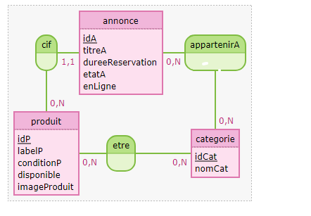
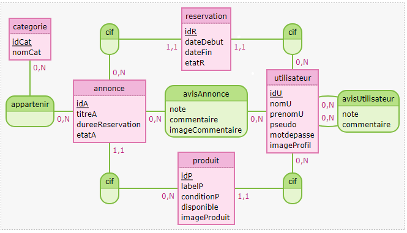
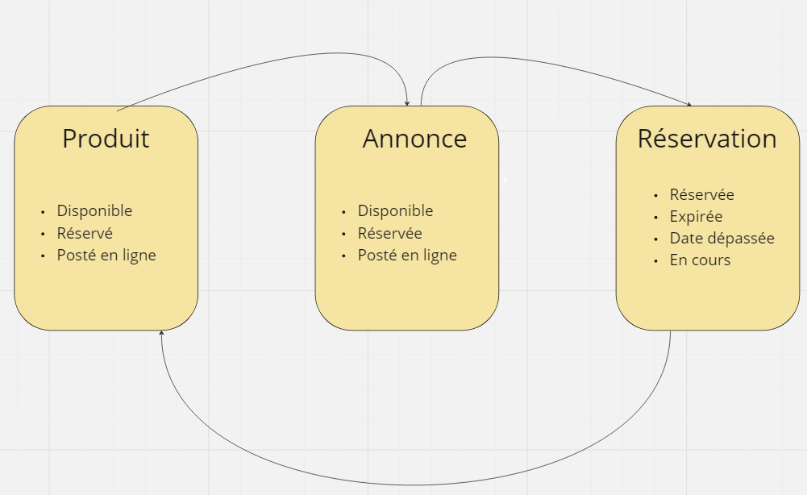

# SAE 4.04 Mobile

Lien du github : https://github.com/Baptched/SAE-Mobile

## Membres du groupe

- Kylian Riberou 
- Baptiste Chédeville

## Rappel du sujet

Développer une application de prêts de bien sur mobile, avec le langage Flutter.

Les utilisateurs peuvent créer un compte pour enregistrer des objets, poster des annonces et réserver les annonces d'autres utilisateurs.

## Lancer l'application

Si vous n'avez pas le matériel nécessaire pour compiler l'application et la lancer sur votre téléphone, une vidéo de présentation des fonctionnalités est présente dans l'arborescence du projet.

## Documentation

### MCD base locale - sqflite

Base locale pour le stockage local de produits et d'annonces d'un utilisateur.

### MCD base distante - supabase

Base en ligne contenant toutes les informations de l'application : utilisateurs, annonces en ligne, réservations, avis, ...

### Diagramme d'états des objets

Différents états qu'un objet peut avoir : 

### Diagramme de classes des objets

## Fonctionnalités implémentées 

- Inscription et connexion à l'application
- Un utilisateur peut personnaliser ses informations et choisir une photo de profil
- Un utilisateur peut enregistrer localement des objets, qu'il pourra mettre dans des annonces
- L'utilisateur peut décider ou non de poster en ligne une annonce.
- Un utilisateur peut voir toutes les annonces en ligne des autres utilisateurs, les mettre en favoris et les réserver
- Un utilisateur, depuis son profil, peut consulter tous ses objets, annonces et réservations
- Un utilisateur peut donner un avis sur une annonce ou sur un autre utilisateur
- Une messagerie est disponible sur l'application

